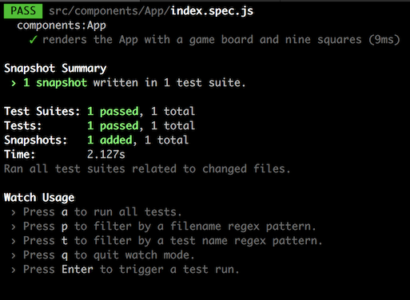

# Adding snapshot tests for our React components

We're going to add tests that take a "snapshot" of our shallowly rendered components. Then each time we run our test suite, we'll shallowly render the component again and check that output against our previous snapshot. This way we are warned when our component's output changes, and we can make sure that the output is what we expected it to be.

`create-react-app` allows us to add our own test setup in a file called `src/setupTests.js`. Whatever we put in that file will be loaded before any tests are run. Think of it as a global configuration for our tests.

Create the file now, and add this code:

```javascript
import Enzyme from 'enzyme'
import Adapter from 'enzyme-adapter-react-16'
import 'jest-enzyme'
import 'jest-styled-components'
import toJson from 'enzyme-to-json'

Enzyme.configure({ adapter: new Adapter() })

global.toJson = toJson
```

First we import Enzyme, which is an AirBnB-created library that helps us to render and test React components. We also need the React version 16 adapter so we can use it with React version 16, which is what we're using to build our game. We can also import all the test "matcher" methods from the `jest-enzyme` library. You'll see these in action later. Then `jest-styled-components` let's us work with `styled-components` in our snapshot tests. Finally, `enzyme-to-json` makes our snapshots prettier and easier to read (for humans, which is what most of us are, probably).

Then we tell Enzyme to use the React 16 Adapter. Finally, we put the `enzyme-to-json` `toJson` function in our `global` object, which is imported into all our test files. That just prevents us from having to import it in every test file.

# First test

Now we'll add our first test. We'll use the extension `spec.js` for all our test files. The `spec` part indicates that we are using a [Behaviour-Driven Development (BDD)](https://en.wikipedia.org/wiki/Behavior-driven_development) style. Don't worry too much about that. The link is for folks who _just have to know_.

So let's create a `src/components/App/index.spec.js` file and add the following code:

```javascript
import React from 'react'
import { shallow } from 'enzyme'

import App from './'

describe('components:App', () => {
  it('renders the App with a game board and nine squares', () => {
    expect(toJson(shallow(<App />))).toMatchSnapshot()
  })
})
```

The `shallow` renderer will render our React component, but only one leve deep. That means that subcomponents will not be fully rendered. But that's OK because we'll test those components individually. Shallow rendering is fast and makes it easier to debug problems because we know that _they're only one level deep!_

We need to import our App component, of course, and here you can see the benefit of using folders with the component name: our components and their tests (and the `__snapshots__` folder to come) are all neatly contained in one spot.

We will group our tests in `describe` blocks, which are just function calls. The `describe` block takes a string description and a function that will group one or more tests together.

Inside the `describe` block, we add a `test` block. `it` is an alias for `test`. I prefer it because it is more readable (and more of a BDD style). Like the `describe` block, `it` takes a string description of the test and a function that runs the actual test.

In the `it` block we call `shallow(<App />)`, passing it our `<App />` component. That renders the `<App />` component _just one level deep. We pass that to our `toJson` function imported from `enzyme-to-json`, which will pretty it up for us. Then we pass that to our `expect` function, and call the expect's "matcher" method `toMatchSnapshot`. This creates our snapshot if it doesn't exist (and puts it in a `__snapshots__` folder). If a snapshot exists, then it compares the two and either passes if they match, or throws an error if they don't.

Simple, really.

We can run our tests:

```bash
yarn test
```

This will run our tests _in watch mode_. Which means it will stay running (kill it with `q`). Each time we update a file or a test, it will re-run.

The first time we run `yarn test`, we should see this:



Talk a look at the `src/components/App/__snapshots__/index.spec.js.snap` file and you should see this:

```javascript
// Jest Snapshot v1, https://goo.gl/fbAQLP

exports[`components:App renders the App with a game board and nine squares 1`] = `
<styled.div>
  <styled.div>
    <Square
      index={0}
      key="0"
      player="x"
    />
    <Square
      index={1}
      key="1"
      player="o"
    />
    <Square
      index={2}
      key="2"
      player="x"
    />
    <Square
      index={3}
      key="3"
      player="o"
    />
    <Square
      index={4}
      key="4"
      player="x"
    />
    <Square
      index={5}
      key="5"
      player="o"
    />
    <Square
      index={6}
      key="6"
      player="x"
    />
    <Square
      index={7}
      key="7"
      player="o"
    />
    <Square
      index={8}
      key="8"
      player="x"
    />
  </styled.div>
</styled.div>
`;
```

Pretty easy to read, right? Note that the `Square` components were not further rendered into their `div` elements. That's shallow rendering at work.

Time for a commit:

```bash
git add -A
git commit -m "Add the test configuration and first snapshot test"
git push
```
